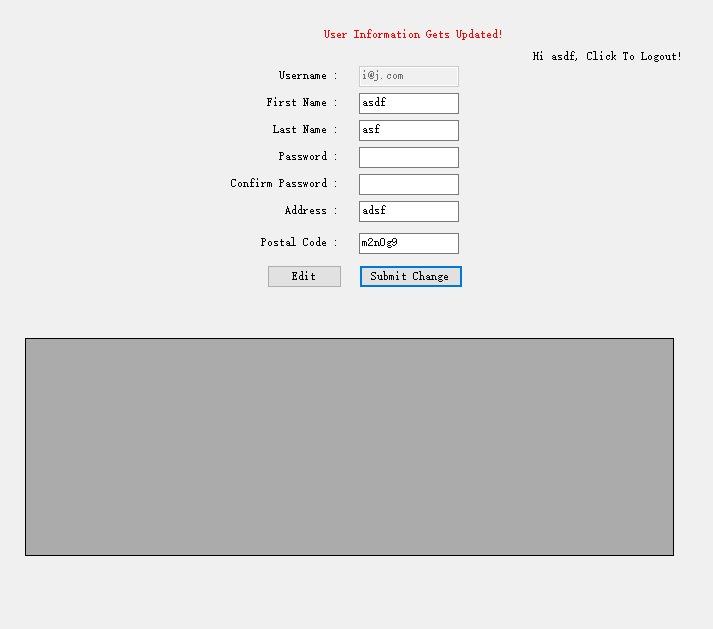
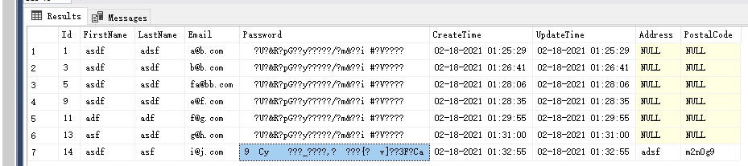

# Coding Assignment - Delivery

# Author: Ma Luo

# Email: james.luo.3131@gmail.com

# Github: https://github.com/maluo/assignmentdemo

Programming is about data structure and algorithm design.  So, regardless of reading business requirement and design our interfaces and class libraries, data types and data source would be first step.

## Sequence diagram
Draft components like actors, UI, data source and service we are going to include in our system firstly.  Then think of the function names and conditions we might need to apply in a sequence of calls.  In this demo, we have user authetication/registration with a couple of validation rules, a user profile page and the feature to edit address field which might be blank at first.
## DatabaseLib (class library) and Entity Framework
Create a class library called Model1 by default and rename it as User.  Please run Generate DB from User.edmx file if it is the first time setting up the demo on your machine.  We might update from MS SQL Server side and update the model mapping.
## Adding interfaces design based on the UML
### Password Hashing

```c#
private static readonly log4net.ILog log =
    log4net.LogManager.GetLogger(System.Reflection.MethodBase.GetCurrentMethod().DeclaringType);

        public static string Hashpass(string pass) {
            string hash = null;
            try
            {
                byte[] data = Encoding.ASCII.GetBytes(pass);
                data = new System.Security.Cryptography.SHA256Managed().ComputeHash(data);
                hash = Encoding.ASCII.GetString(data);
            }
            catch (Exception e) {
                log.Error(e.Message);
            }
            return hash;
        }
```


### Log4Net Configration

```xml
<log4net>
    <root>
      <level value="ALL" />
      <appender-ref ref="MyFileAppender" />
      <appender-ref ref="RollingFileAppender" />
    </root>
    <appender name="MyFileAppender" type="log4net.Appender.FileAppender">
      <file value="application.log" />
      <appendToFile value="true" />
      <lockingModel type="log4net.Appender.FileAppender+MinimalLock" />
      <layout type="log4net.Layout.PatternLayout">
        <conversionPattern value="%date %level %logger - %message%newline" />
      </layout>
    </appender>
    <!--if file size is too large-->
    <appender name="RollingFileAppender" type="log4net.Appender.RollingFileAppender">
      <file value="rolling.log" />
      <appendToFile value="true" />
      <rollingStyle value="Size" />
      <maxSizeRollBackups value="5" />
      <maximumFileSize value="10MB" />
      <staticLogFileName value="true" />
      <layout type="log4net.Layout.PatternLayout">
        <conversionPattern value="%date [%thread] %level %logger - %message%newline" />
      </layout>
    </appender>
  </log4net>
```


## A couple of quick Unit Test

Supposed to create a UnitTest here, but skipped cause we only have two main functions which could be tested easily by making a sequence of calls from front-end.

## Front-end design - Windows Form / ASP .NET MVC

Picked Windows Form with ViewState design to make the setup process easier, the backend core could be easily moved into MVC.

### We manage hide and show panel from Windows Form to arrange the access control

## Results




